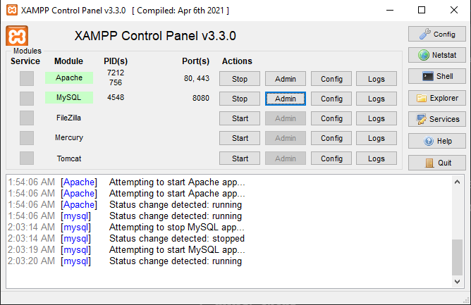
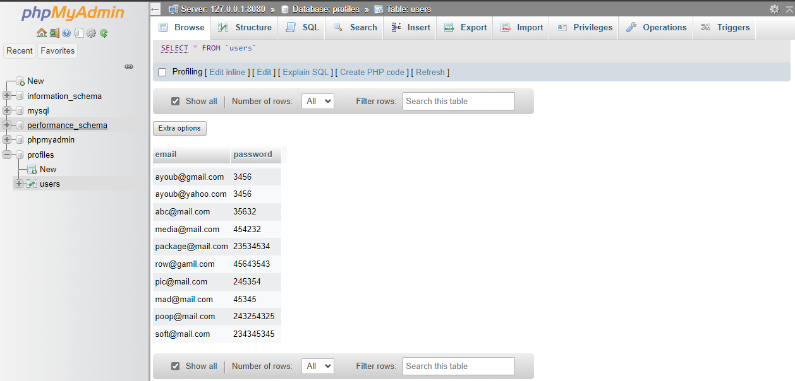
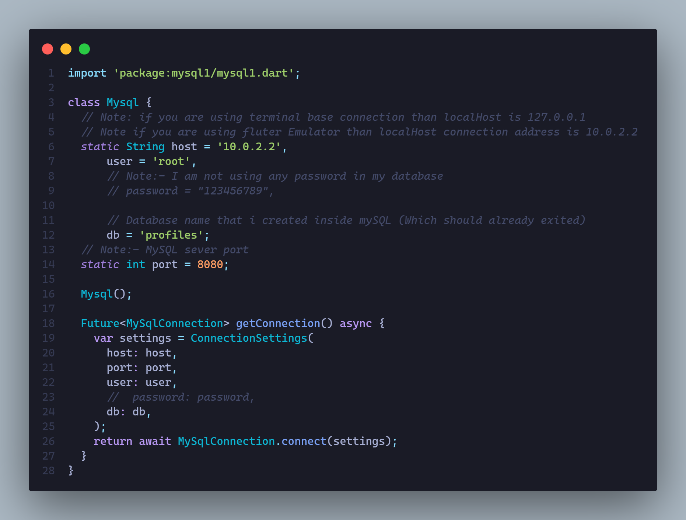
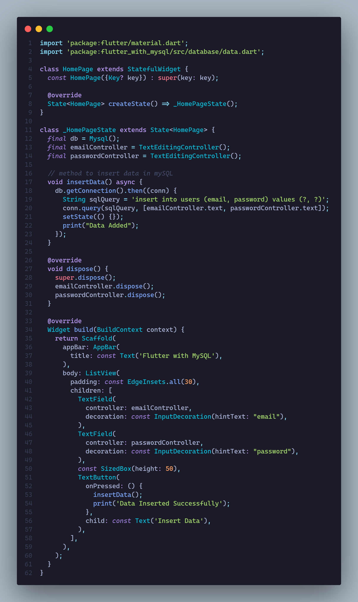
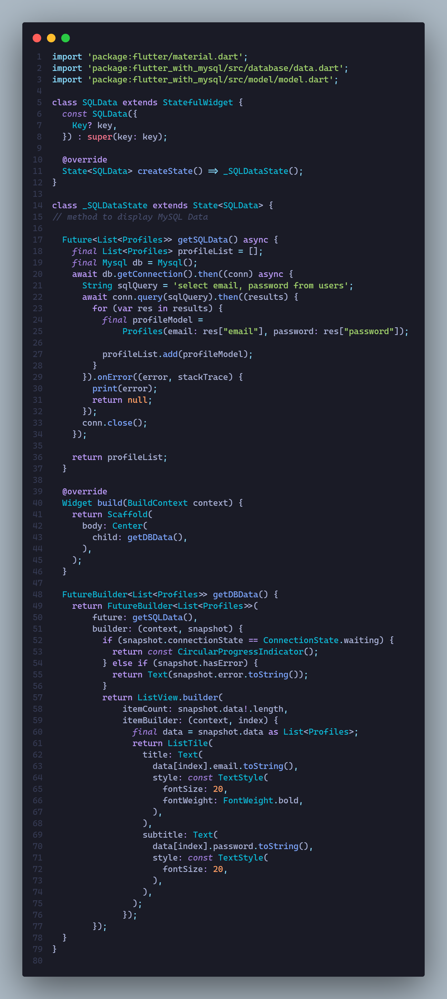

# flutter_with_mysql

A new Flutter MySQL Database project.

## Introduction

This repo showcase the how to implement MySQL database inside flutter app without using any external service.

## Explanation

First you have to start Xampp service and start apache service and MySQL service if you are using Windows OR if you are using MacOS you can use MySQL workbench

## Package

We will use mysql1 package for this purpose. But if you don’t like it, you can also use mysql_client package for this purpose. Links are given blow for both packages.

1:- mysql1
2:- mysql_client

## Step 1

First thing you have to do is to create a database inside MySQL. If you are using Windows, use Xampp controller and start Apache Server and also MySQL server.

You can edit the port in config option or leave it default and click on Admin option to lead the phpMyAdmin

as you can see that, it’s running on local host. You can click on *New option to create a database such as I created profiles, and its table is users and as you see the data inside that I inserted using flutter.

You can also create table using packages mentioned above, but I prefer it creating inside phpMyAdmin. The *new option inside the profiles is to create a table.

## Step 2:-

Now it’s time to set up our database connection using package

## Insert Data

## Show Data

## Important Note:-

About localHost always use ‘10.0.2.2’ for android/IOS app because you will end up with socket error.

If you use wrong password than it will end up with this error

ERROR 1045 (28000): Access denied for user ‘root’@’localhost’ (using password: YES)

Also, this is direct connection to our MySQL database which totally scary to use because it can be easily accessible by any other third party person and your whole database will be compromised. It’s best to use server to integrate MySQL database service.

Which you can do using dart_frog package to create a server with dart, or you can use any other backend service to create a custom server.
